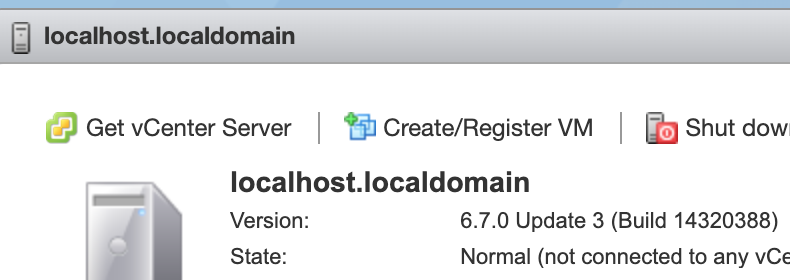

Vsphere Integration
========================

OPS works perfectly fine with VSphere ESX 6.7 and 7.0.

It uses the pvsci driver for storage and vmnetx3 for networking.

For most operations you'll want to use the following config and you'll
need access to your API key and the access key and secret access key
found in your portal:

```json
{
  "CloudConfig" :{
    "ProjectID" :"prod-1033",
    "Zone": "us-west2-a",
    "BucketName":"nanos-test"
  }
}
```

```sh
package main

import (
  "fmt"
  "net/http"
)

func main() {
  fmt.Println("hello world!")

  http.HandleFunc("/", func(w http.ResponseWriter, r *http.Request) {
    fmt.Fprintf(w, "Welcome to my website!")
  })

  fs := http.FileServer(http.Dir("static/"))
  http.Handle("/static/", http.StripPrefix("/static/", fs))

  http.ListenAndServe("0.0.0.0:8080", nil)
}
```

## Image Operations
### Create Image

This creates a monolithicFlat image (2 files) and uploads it to
vsphere's datastorage.

```sh

export GOVC_INSECURE=1
export GOVC_URL="login:pass@host:port"

GOOS=linux go build -o gtest

ops image create -c config.json -t vsphere -a gtest

```

### List Images

```sh
export GOVC_INSECURE=1
export GOVC_URL="login:pass@host:port"

ops image list -t vsphere
```

### Delete Image

## Instance Operations
### Create Instance

The domain part of the Resource Pool is in this example, 'localhost.localdomain'. You can find that in your portal.



```sh
export GOVC_INSECURE=1
export GOVC_URL="login:pass@host:port"
export GOVC_RESOURCE_POOL="/ha-datacenter/host/localhost.localdomain/Resources"

ops instance create -z us-west2-a -t vsphere -i gtest
```

### Start an Instance

```sh
export GOVC_INSECURE=1
export GOVC_URL="login:pass@host:port"

ops instance start mytest -t vsphere -z us-west-2
```

### List Instances

```sh
export GOVC_INSECURE=1
export GOVC_URL="login:pass@host:port"

ops instance list -t vsphere -z us-west-2
```

## Get Logs for Instance

There is outstanding work to add support for grabbing the logs.

### Delete Instance

